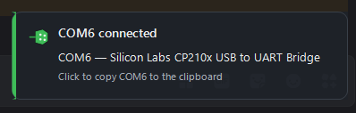

# ComNotify

A Windows tray utility for anyone who keeps asking *"which COM port did it get this time?"*



> Built from a single prompt to Claude — no hand-editing afterwards. Seems to work just fine.

* Pops up a notification the moment a USB-to-serial adapter is **plugged in** — showing the COM
  port it was assigned — and again when one is **unplugged**.
* Click the tray icon for a list of every serial port Windows knows about, including adapters
  that are currently disconnected. Clicking a port copies its name (`COM7`) to the clipboard.
* Double-click the tray icon (or run the app a second time) for a details window with the
  description, vendor, VID/PID, serial number and device instance ID of every port.

No runtime to install, no admin rights, no background service — a single ~58 KB exe that talks to
Windows' own device manager APIs.

---

## Build

Everything compiles with the C# compiler that already ships inside Windows
(`%WINDIR%\Microsoft.NET\Framework64\v4.0.30319\csc.exe`). No SDK, Visual Studio or NuGet needed.

```powershell
# just the app  ->  bin\ComNotify.exe
powershell -ExecutionPolicy Bypass -File build.ps1

# app + installer + portable zip  ->  dist\
powershell -ExecutionPolicy Bypass -File build-installer.ps1
```

`build.ps1 -Run` builds and launches. `build-installer.ps1 -SkipApp` reuses the existing
`bin\ComNotify.exe` instead of rebuilding it.

The build produces:

| File | What it is |
| --- | --- |
| `bin\ComNotify.exe` | the application |
| `bin\ComNotify.ico` | generated app icon (drawn by `tools\make-icon.ps1`) |
| `dist\ComNotify-Setup.exe` | single-file installer with the app embedded inside it |
| `dist\ComNotify-1.0.0-portable.zip` | the bare exe, for people who do not want an installer |

## Install

Run `dist\ComNotify-Setup.exe`. It installs **per user** — into
`%LOCALAPPDATA%\Programs\ComNotify`, with its registry entries under `HKCU` — so it never asks for
elevation. It offers a Start-menu shortcut, an optional desktop shortcut, and a "start when I sign
in" option, and it registers itself in **Settings › Apps › Installed apps** for normal removal.

Unattended:

```powershell
ComNotify-Setup.exe /silent [/dir="D:\Tools\ComNotify"] [/desktop] [/autostart] [/launch] [/noshortcut]
ComNotify-Setup.exe /uninstall [/silent]
```

Or skip the installer entirely: unzip the portable build and run `ComNotify.exe` from anywhere.

> **Windows 11 hides new tray icons by default.** After the first run, click the `^` arrow next to
> the clock and drag ComNotify onto the taskbar (or use *Settings › Personalization › Taskbar ›
> Other system tray icons*) to keep it visible. The connect/disconnect popup works either way.

## Using it

**Left- or right-click the tray icon** for the menu:

```
Connected (2)
  COM7   USB-SERIAL CH340 (QinHeng (CH34x))      <- bold = USB adapter
  COM3   Standard Serial over Bluetooth link
Previously seen (1)
  COM4   Silicon Labs CP210x UART Bridge          <- greyed = not plugged in
------------------------------------------------
Details...
Copy connected port list
Refresh
Options >
Exit
```

Clicking any port copies its name to the clipboard. Hovering shows the full device details.

**Options** (remembered in `HKCU\Software\ComNotify`):

| Option | Default | Effect |
| --- | --- | --- |
| Notify when a port connects | on | popup on plug-in |
| Notify when a port disconnects | on | popup on unplug |
| Play a sound | on | system Asterisk / Exclamation |
| Use built-in popup (not Windows balloon) | on | see below |
| Show non-USB ports | on | include Bluetooth, on-board and virtual ports |
| Show previously seen ports | on | list installed-but-unplugged adapters |
| Start with Windows | off | `HKCU\...\CurrentVersion\Run` entry |

The built-in popup is the default because Windows balloon tips are silently suppressed when
notifications are muted or Focus Assist / Do Not Disturb is on. The popup appears above the tray,
never steals focus, fades out after a few seconds, pauses while the mouse is over it, and copies
the port name when clicked. Turn the option off to use native Windows notifications instead.

## How it works

* **Detection** — a hidden top-level window registers for `WM_DEVICECHANGE` on the COM-port device
  interface class (`GUID_DEVINTERFACE_COMPORT`) and also listens for `DBT_DEVNODES_CHANGED` as a
  backstop. Events are debounced by 600 ms, then the port list is re-enumerated and diffed, so a
  device that re-enumerates several times while its driver loads produces one notification.
* **Enumeration** — `SetupDiGetClassDevs` over the *Ports* and *Modem* device classes, run twice:
  once with `DIGCF_PRESENT` and once without. The difference is what gives you the
  "previously seen" list — adapters whose driver is installed but which are unplugged right now.
  The COM name comes from the device's hardware key (`PortName`), falling back to parsing
  `(COMx)` out of the friendly name.
* **Identification** — VID/PID are parsed from the device instance ID and hardware IDs, and a small
  vendor table maps common IDs (FTDI, Silicon Labs, CH34x, Prolific, Espressif, STM…) to readable
  names, because the driver's own manufacturer string is often just "Microsoft".
* **Ports vs. devices** — ports are tracked by device instance ID, not COM number, so if Windows
  reassigns an adapter to a different COM number you get told about it.

## Project layout

```
build.ps1               build the app
build-installer.ps1     build the app + installer + portable zip
tools/make-icon.ps1     draws bin\ComNotify.ico (no binary assets in the repo)
src/
  Program.cs            entry point, single-instance handling
  TrayContext.cs        tray icon, device-change plumbing, menu
  PortEnumerator.cs     SetupAPI enumeration
  PortInfo.cs           one port + the USB vendor table
  ToastForm.cs          the connect/disconnect popup
  DetailsForm.cs        the full port table
  IconFactory.cs        draws the tray icon at runtime
  Settings.cs           HKCU settings and the run-at-logon entry
  Ui.cs                 DPI scaling helpers
  Native.cs             P/Invoke declarations
  app.manifest          asInvoker, system-DPI aware
installer/
  Setup.cs              the installer/uninstaller (app embedded as a resource)
  setup.manifest
```

## Notes and limits

* Requires .NET Framework 4.x, which is part of Windows — nothing to install.
* System-DPI aware: pixel metrics are scaled by hand (`Ui.Px`). On a multi-monitor setup with
  *different* scaling factors, Windows bitmap-scales the windows on the secondary monitor.
* Windows sometimes garbage-collects the device node of an adapter you have not plugged in for a
  while; once that happens it can no longer appear under "previously seen".
* The app is unsigned, so SmartScreen may warn on first run of the installer
  ("More info" › "Run anyway").
